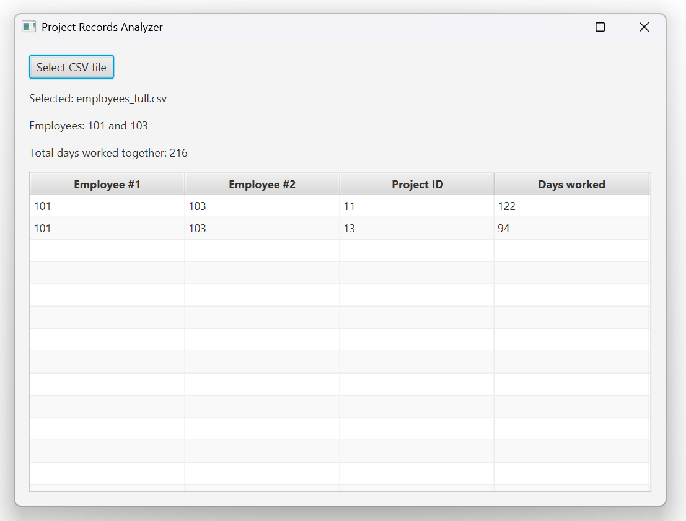

# Project Records Analyzer

## Overview
Desktop application that reads CSV files and identifies the pair of employees who have worked together on common projects for the longest total period of time.

## UI Preview


## Features
- JavaFX UI for selecting CSV files
- Parses multiple date formats
- Empty / NULL DateTo values are treated as current date
- Displays common projects for the longest working employee pair
- Input validation with clear error messages
- Unit and integration tests

## Tech Stack
Java 25, Gradle, JavaFX, JUnit 5, Mockito, Lombok

## Run Application
```./gradlew run```

## Run Tests
```./gradlew test```

## Assumptions
- If multiple pairs share the same maximum duration, a single pair is returned.
- Input project records are not pre-sorted.
- One employee appears at most once per project.
- Overlap is inclusive of the end date.
- Input size is moderate and fits in memory.

## Complexity
Let ```n``` = total records, grouped by project.

For each project with ```k``` employees:

- Pair comparison cost: ```O(k²)```
- Overall: ``` O(sum of k² across all projects) ```
- Memory: ```O(n)```

## Supported Date Formats
- yyyy-MM-dd
- dd-MM-yyyy
- MM/dd/yyyy
- dd/MM/yyyy
- yyyy/MM/dd
- dd MMM yyyy
- yyyyMMdd